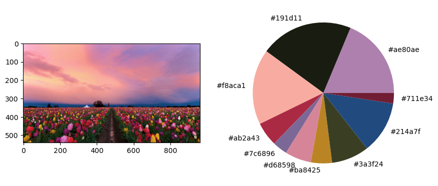

# 🎨 Dominant Color Extractor using KMeans

This project provides a simple yet effective tool for identifying and visualizing the **dominant colors** in images using **KMeans clustering**. Ideal for data visualization, digital design, and image analysis applications.

---

## ✨ Features

- 📷 Load and display multiple images from a directory
- 🎨 Extract top N dominant colors using KMeans clustering
- 📊 Visualize color distribution with pie charts and HEX codes
- ⚡ Fast performance using image resizing and efficient NumPy operations
- 💡 Modular functions for easy reuse in other projects

---

## 🖥️ Example Output

- Side-by-side image preview
- Pie chart of dominant colors (with RGB to HEX conversion)

 <!-- Replace with your screenshot or GIF -->

---

## 🧰 Technologies Used

- Python
- OpenCV (`cv2`) for image loading and color space conversion
- `scikit-learn` for KMeans clustering
- `matplotlib` and `seaborn` for plotting
- `numpy` for numerical operations

---

## 📦 Installation

Clone the repository and install the dependencies:

```bash
git clone https://github.com/fares-mady/dominant-color-extractor.git
cd dominant-color-extractor
pip install -r requirements.txt
